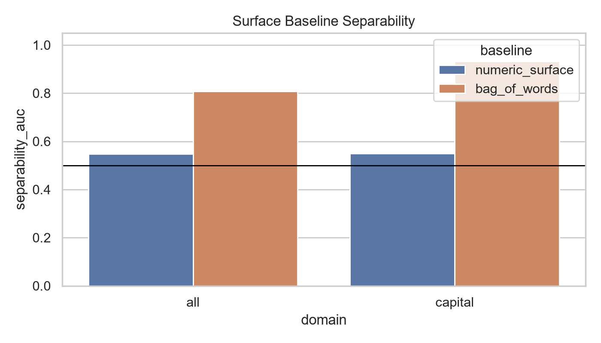
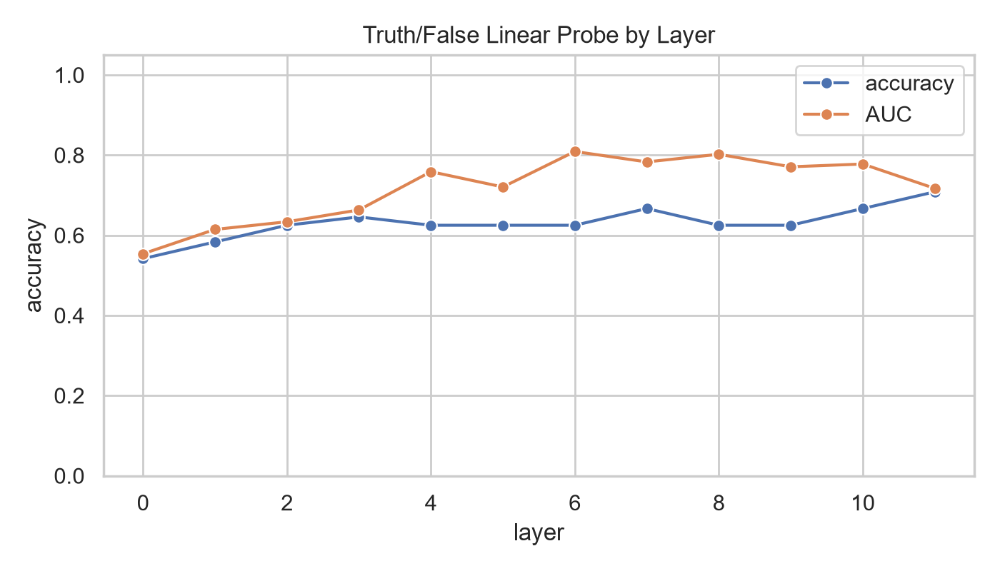
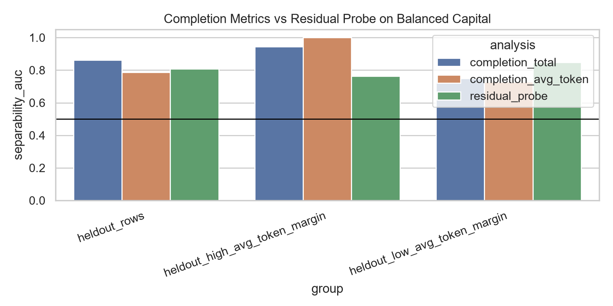
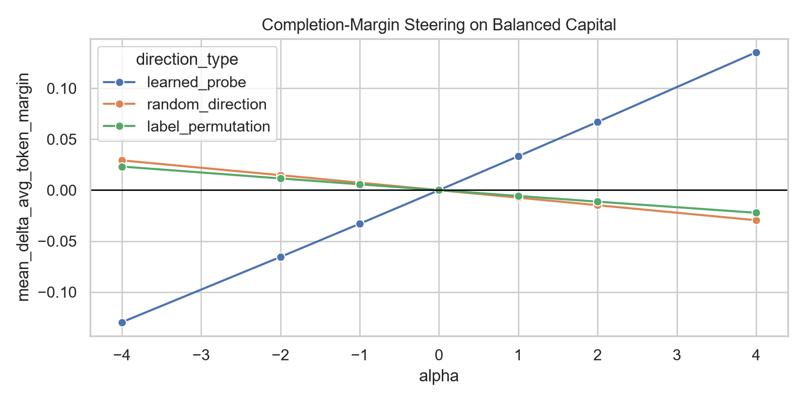
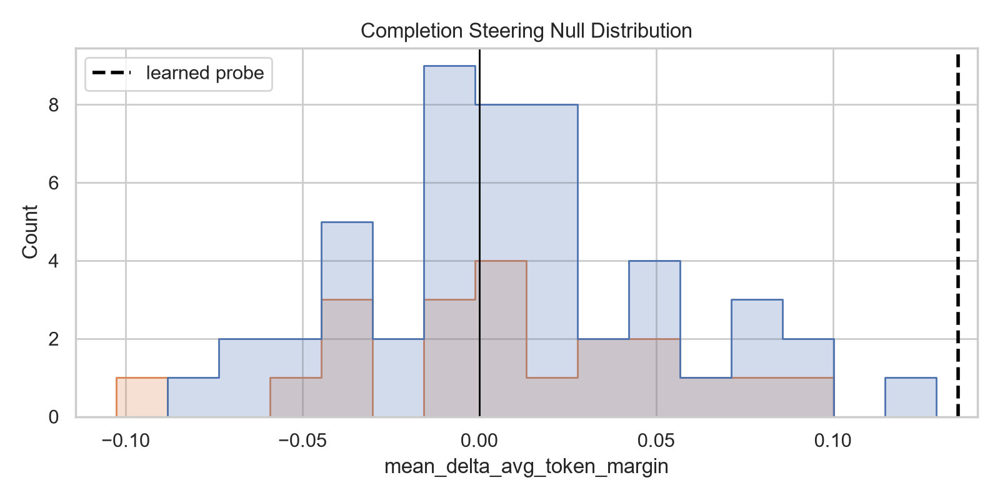
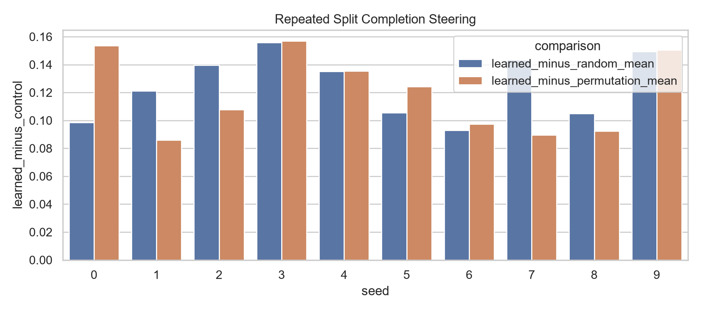
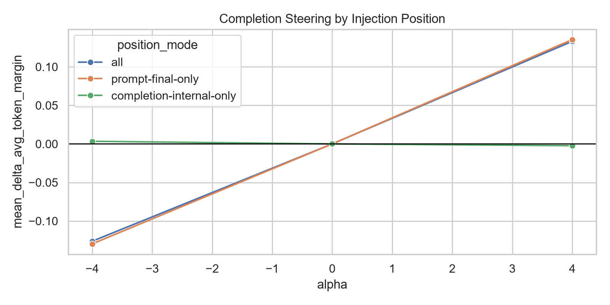

# GPT-2-small 事实配对标签信号的线性可分性、补全兼容度与干预边界

## 摘要

本文研究 GPT-2-small 在人工事实验证任务中的 final-token residual stream 是否包含可线性读出的事实配对标签信号，以及该信号是否能通过推理时干预影响模型的后续补全评分。实验首先发现，原始首都事实数据上的 residual probe 很强，layer 8 AUC 为 0.953；但词袋 surface baseline 的方向无关 AUC 也达到 0.933，说明原始高分受到明显词汇伪线索放大。为此，本文构造词汇平衡首都数据集，使每个国家名和首都名在 true/false 标签中的边际频率完全平衡。在该设置下，bag-of-words 和 numeric surface baseline 均降到 0.500，而 layer 6 residual probe 仍保留 0.809 AUC，多 seed mean AUC 为 0.813。

进一步实验显示，这一信号与模型补全兼容度相关，但不是直接的事实选择机制。补全评分 margin 中，total logprob AUC 为 0.861，但按 token 数归一化后 avg-token AUC 降至 0.786，与 residual probe 的 0.809 高度重叠。沿 balanced layer 6 标签相关方向在 prompt-final residual state 上进行干预，可将 held-out avg-token 补全评分 margin 推动约 +0.135，并超过当前采样的 50 条随机方向和 20 条乱标签方向。10 个 repeated group splits 中，learned shift 均为正，均值为 +0.116。

这种效果主要停留在评分层面。当前主 split 的 pairwise preference accuracy 没有改变；repeated splits 中 pairwise accuracy 只从 0.700 提升到 0.725；candidate-set rank 检查中，正确首都平均 rank 从 15.04 改善到 14.13，top-1 accuracy 仅从 0.083 到 0.125。因此，本文的结论是：GPT-2-small 在词汇平衡首都事实中存在一个可读且可弱干预的事实配对标签信号；它能影响“正确首都 vs 选定错误首都”的补全评分 margin，但尚不能解释为跨领域稳定、可直接控制输出的全局 truth direction，也尚未定位完整事实机制路径。

## 1. Introduction

机制可解释性中，linear probe 常被用来判断模型隐状态是否包含某类信息。但 probe AUC 高并不自动说明模型自然计算中使用了该方向，也不说明该方向能稳定控制模型行为。围绕 truth direction 的工作尤其容易被误读：一个能够区分 true/false 标签的方向，可能来自抽象事实表征，也可能来自数据构造、实体频率、模板形式、补全概率或标签泄漏。

本文选择一个小而可控的现象：GPT-2-small 对人工事实验证句子的 true/false 标签是否在 residual stream 中形成可读信号。研究问题分为三层：

1. **读出层面**：residual activation 中是否存在可线性读出的事实配对标签信号。
2. **定位层面**：该信号出现在哪些 layer / token position，并是否受词汇伪线索影响。
3. **干预层面**：沿该方向进行推理时干预，是否能改变模型后续补全评分或选择行为。

本文的贡献有三点。第一，展示原始首都事实 probe 的高 AUC 很大程度上被词汇结构放大，并用词汇平衡数据集拆除这一伪线索。第二，在平衡数据上仍观察到中等强度 residual signal：事实验证 prompt 的 layer 6 final-token activation 可读，且迁移到 bare completion prompt 的 layer 6 final position 后可移动补全评分 margin。第三，通过随机方向、乱标签方向、position decomposition、repeated splits 和 candidate rank 检查，说明该方向主要产生评分层面影响，选择层面改善较弱。

## 2. Related Work and Reproduction Scope

本文参考 Bao et al. [1] 的 *Probing the Geometry of Truth: Consistency and Generalization of Truth Directions in LLMs Across Logical Transformations and Question Answering Tasks*。该工作关注 truthfulness probes 是否能跨任务、逻辑变换、问答形式和知识源泛化，并提醒 truth direction 的解释需要经过迁移与行为检验。本文不是完整复现其全部实验，而是在 GPT-2-small [2] 上做受控小模型复现与扩展。

方法上，本文使用 TransformerLens [3] hook 机制提取 residual stream activation，并借鉴 logit lens [4]、activation patching / causal tracing [5,6]、truth geometry / linear probing [7,8] 和 activation engineering [9] 的基本流程。与完整 circuit 级工作相比，本文只做到 layer-level readout、position-specific intervention 和方向级干预，还没有展开 head/MLP/path-level 的机制分解。

| 类型 | 研究问题 | 本文对应实验 | 结论关系 |
|---|---|---|---|
| Bao et al. 对照 | hidden state 中能否训练 truthfulness probe | GPT-2-small final-token `resid_post` probe | 复现线性可读现象，但仅限人工事实验证数据 |
| Bao et al. 对照 | truth direction 是否跨任务泛化 | domain transfer 与 direction cosine | 未提供统一方向证据；地理相关任务有局部共享结构 |
| Bao et al. 对照 | probe 能否用于下游行为 | completion-margin steering、output readout baseline | 能弱移动补全评分，不能稳定改善 pairwise choice |
| 本文扩展 | 高 probe AUC 是否受数据伪线索影响 | surface baseline、balanced dataset、completion margin | 强化 confound 诊断，说明高 AUC 容易来自数据结构 |

未复现的部分包括 Bao et al. 的完整 logical transformation、QA、ICL、external knowledge 数据、多模型比较和 selective QA 应用。因此本文更接近一个面向课程项目的小模型机制分析：复现 truth-direction generalization 的核心问题意识，并通过更强的 surface/balanced/steering 控制实验检查解释边界。

## 3. Methods

### 3.1 数据与模型

原始数据集 `data/facts.csv` 包含 528 条英文事实验证样本，覆盖 capital、continent、element_symbol、book_author、landmark_country、science、math 七类。主线使用首都事实，因为它可以自然形成 correct-vs-wrong completion 评价，也便于构造词汇平衡对照。

词汇平衡数据集 `data/capital_balanced.csv` 使用二国二首都闭合 block。例如：

```text
France  - Paris   true
France  - Berlin  false
Germany - Berlin  true
Germany - Paris   false
```

这样国家名和首都名在 true/false 标签中的边际频率完全平衡。该数据集共有 152 行、38 个 block。当前主 split 的 held-out 部分为 12 个 block / 48 行。数据中存在少量有定义或政治语境差异的事实，例如 `Israel -> Jerusalem`、`South Africa -> Pretoria`、`Bolivia -> Sucre`；continent 任务也使用了简化标签，例如把 Australia/Oceania 相关国家统一标为 `Australia`。本文用 ambiguous-fact sensitivity 删除首都任务中的争议 block 后重新划分，检查主线结果是否定性保留。

### 3.2 实验设置

| 项目 | 设置 |
|---|---|
| 模型 | GPT-2-small |
| checkpoint | TransformerLens/Hugging Face 的 `gpt2-small` 预训练权重 |
| 框架 | TransformerLens；`HookedTransformer.from_pretrained(model_name, device="cpu", dtype=torch.float32)` |
| 主要 activation | final-token `resid_post` |
| 数据划分 | `GroupShuffleSplit(test_size=0.3, random_state=42)`；按 `pair_id` 分组 |
| balanced group key | `capital_balanced` 中一个 `pair_id` 对应完整四行二国二首都 block |
| probe | `StandardScaler()` + `LogisticRegression(C=1.0, penalty="l2", solver="lbfgs", fit_intercept=True, max_iter=2000, class_weight="balanced", random_state=42)` |
| 标准化 | scaler 只在训练集拟合，再应用到 held-out split |
| probe score | AUC 使用 `predict_proba(... )[:, 1]`；accuracy 使用 0.5 概率阈值 |
| 主要层 | 原始 capital 使用 layer 8；词汇平衡主线使用 layer 6 |
| 干预位置 | prompt-final residual state；另比较 all positions 和 completion-internal-only |
| steering direction | 由训练集 probe 权重转换回原 activation basis 后做 L2 归一化 |
| alpha | 主报告关注 `alpha = ±4`，并展示 alpha sweep |
| completion 指标 | 正确首都与选定错误首都的 total logprob margin 和 avg-token margin |
| bootstrap | 以 `pair_id` block 为采样单位，主实验 2000 次；随机种子为 42 |
| controls | L2-normalized Gaussian random directions、label-permutation probe directions |
| 软件环境 | 在 Windows + Python 虚拟环境中运行；完整依赖见 `requirements.txt`，实际版本以本地环境为准 |

Layer 6 是在主 split 的 balanced probe sweep 中选定的，随后固定用于 completion-margin steering、sampled null controls、position decomposition 和 repeated-split experiments。因此，主 split 上 layer-specific 结果带有探索性选择成分；repeated split experiments 用于检查固定该层后 effect 是否仍能跨多个 group split 重复出现。alpha sweep 预先使用对称集合 `{-4, -2, -1, 0, 1, 2, 4}`，`alpha=4` 作为正向端点用于 null-control 比较。当前 bootstrap/null CI 没有把 layer 选择的不确定性纳入区间。

### 3.3 指标

probe 主要报告 accuracy、AUC，以及方向无关 AUC（direction-agnostic AUC）。方向无关 AUC 定义为 `max(AUC, 1-AUC)`，只用于诊断预测分数与标签之间是否存在强排序关系，不表示标签方向能从训练集稳定泛化到测试集。

completion margin 定义为：

```text
completion_total_margin =
  log p(correct capital | prompt) - log p(false capital | prompt)

completion_avg_token_margin =
  mean_token_logp(correct capital | prompt) - mean_token_logp(false capital | prompt)
```

total logprob 更接近完整 completion 概率，但偏向短 completion；avg-token logprob 缓解长度差异，但改变了指标含义。因此本文同时报告两者，并将 avg-token margin 作为 steering 主指标。

## 4. Results

### 4.1 词汇伪线索放大了原始 probe

原始 capital probe 很强：layer 8 AUC 为 0.953，layer 10 AUC 为 0.947，layer 5 AUC 为 0.941。seed sensitivity 显示 layer 8 在六个 group split 上 mean AUC 为 0.899，范围为 0.832-0.953，说明结果不是单一 seed 的偶然现象。

但 surface baseline 暴露了核心 confound。原始 capital 中，numeric surface baseline 较弱，direction-agnostic AUC 为 0.549；bag-of-words 的普通 AUC 几乎反向，为 0.067，但方向无关 AUC 达到 0.933。这说明原始标签与词汇分布之间存在强线性结构，不能把原始 residual probe 的 0.953 AUC 直接解释为抽象事实表征。

如图 1 所示，词袋 baseline 的方向无关 AUC 接近原始 residual probe，说明原始数据的高 probe AUC 不能单独作为机制证据。



**图 1　原始数据上的 surface baseline。** BOW 的普通 AUC 发生方向反转，但方向无关 AUC 达到 0.933，暴露出明显词汇结构。

词汇平衡数据集拆除了最直接的 unigram 边际频率线索。在 `capital_balanced` 上，numeric surface 和 bag-of-words baseline 的 accuracy、AUC、direction-agnostic AUC 均为 0.500。

### 4.2 平衡数据上仍存在 residual 可分性

去掉词汇边际频率线索后，residual probe 仍有中等强度可分性。`capital_balanced` 上 layer 6 AUC 为 0.809，layer 8 AUC 为 0.802，layer 7 AUC 为 0.783。多 seed 检查中，layer 6 mean AUC 为 0.813，layer 8 mean AUC 为 0.804。

如图 2 所示，词汇平衡后 surface baseline 降到随机水平，但 residual probe 在中层仍保留可分性。



**图 2　词汇平衡首都数据上的 layer probe。** layer 6、7、8 的 held-out AUC 仍高于随机，其中 layer 6 是后续 balanced steering 主线使用的层。

从定位角度看，本文完成的是两步证据，而不是完整统一路径定位：在事实验证 prompt 中，layer 6 final-token residual activation 的标签可读性较强；将该方向迁移到 bare completion prompt 的 layer 6 final position 进行单点干预，能够移动后续补全评分。该结果构成 layer-level readout localization 和 cross-format position-specific intervention evidence，但尚不是统一计算路径的完整 layer-position localization。当前仍未定位负责生成或传递该效应的具体 attention head、MLP 与下游 computation path。

### 4.3 剩余信号与补全兼容度相关但不等价

为了连接 activation signal 与模型行为，本文使用首都补全偏好作为行为侧指标。例如：

```text
The capital of France is Paris
The capital of France is Berlin
```

在同一 held-out split 上，completion total logprob AUC 为 0.861，看起来高于 residual probe 的 0.809；但 held-out 中有 24 行 correct/false capital token 数不同。按 token 数归一化后，completion avg-token AUC 降到 0.786，低于 residual probe。三者的 block bootstrap CI 高度重叠。

| Analysis | Rows | Blocks | Accuracy | AUC | 95% Block Bootstrap CI |
|---|---:|---:|---:|---:|---:|
| completion_total | 48 | 12 | 0.750 | 0.861 | [0.753, 0.955] |
| completion_avg_token | 48 | 12 | 0.625 | 0.786 | [0.674, 0.891] |
| residual_probe | 48 | 12 | 0.625 | 0.809 | [0.708, 0.922] |

如图 3 所示，completion total logprob 与 avg-token logprob 对结论强度的影响不同，因此本文后续以 avg-token margin 作为更保守的 steering 指标。



**图 3　补全兼容度 baseline。** total logprob AUC 高于 residual probe，但长度归一化后的 avg-token AUC 下降，三者 block bootstrap 区间高度重叠。

这说明剩余 activation signal 与补全兼容度有关，但 total/avg-token 定义会影响结论。本文因此把 completion margin 视为行为侧线索，而不是事实知识的直接度量。

### 4.4 标签相关方向能弱移动补全评分

主线干预使用 balanced layer 6 标签相关方向，并在 bare completion prompt 的 prompt-final residual state 上加上 `alpha * direction`。该方向先在 statement true/false prompt 上训练，再迁移到首都补全 prompt，因此这是一个 cross-format transfer 设置。

当前主 split 的 prompt-final-only 结果如下。`alpha=+4` 时，learned direction 将 held-out avg-token margin 推动 +0.135；`alpha=-4` 时，margin shift 为 -0.130。random direction 和 label-permutation direction 在 `alpha=+4` 时分别为 -0.030 和 -0.022。

如图 4 所示，learned direction 的 alpha 曲线方向稳定：正向 alpha 提高 avg-token margin，负向 alpha 降低该 margin。



**图 4　completion-margin steering alpha 曲线。** 主线方向为 balanced layer 6 probe direction，干预位置为 bare completion prompt 的 prompt-final residual state。

paired block bootstrap 直接比较同一批 held-out block：learned - random 的 estimate 为 +0.165，95% paired block CI 为 [0.096, 0.239]；learned - label permutation 的 estimate 为 +0.158，CI 为 [0.090, 0.232]。

sampled null distribution 设置为 prompt-final-only、alpha=+4、held-out countries。learned effect 超过全部 50 条随机方向和全部 20 条乱标签方向；经验 p 值的分辨率分别约为 1/51 和 1/21，因此只能解释为 sampled controls 下的强对照结果，而不是精确显著性估计。

如图 5 所示，learned direction 的 effect 位于当前 sampled null controls 之外。



**图 5　sampled null distribution。** null controls 包含 50 条 L2-normalized Gaussian random directions 和 20 条 label-permutation probe directions；经验 p 值受采样数量限制。

### 4.5 效果跨 split 重复，但选择层面改善有限

为了检查单 split 限制，本文进一步做 10 个 repeated group splits。每个 split 训练一个 balanced layer 6 direction，测试 prompt-final-only `alpha=+4`，并采样 10 条 random directions 与 5 条 label-permutation directions。

| Metric | Result |
|---|---:|
| learned delta mean | +0.116 |
| learned delta std | 0.023 |
| learned delta min / max | +0.085 / +0.150 |
| mean learned-minus-random | +0.125 |
| mean learned-minus-permutation | +0.119 |
| learned delta > 0 | 10/10 splits |
| learned > all sampled random directions | 10/10 splits |
| learned > all sampled permutation directions | 10/10 splits |

如图 6 所示，learned margin shift 在 10 个 repeated group splits 中均为正，但这些 split 共享同一数据池。



**图 6　repeated group split steering。** 该图用于检查结果是否依赖单一划分，不应被解释为 10 个相互独立实验的正式假设检验。

这些 repeated splits 共享同一个数据池，训练和测试国家集合会部分重叠，因此 10/10 为正主要说明结果不是某个单一 seed 或划分的偶然现象，不能等同于 10 个相互独立实验构成的正式假设检验。

选择层面改善明显更弱。当前主 split 的 pairwise preference accuracy 没有改变，sign flip 为 0。repeated splits 中 baseline pairwise accuracy 为 0.700，steered 后为 0.725，平均只提升 +0.025；在全部 repeated-split 测试出现次数中，共观察到 6 次 wrong -> correct flip 和 0 次 correct -> wrong flip。由于不同 split 的测试集合可能重叠，这些是 6 次翻转评估事件，不一定对应 6 个不同国家。candidate-set rank 检查把候选从一个选定错误首都扩展到 76 个首都候选：正确首都平均 rank 从 15.04 改善到 14.13，top-1 accuracy 只从 0.083 到 0.125。

### 4.6 效果主要来自 prompt-final position

position decomposition 比较 all positions、prompt-final-only 和 completion-internal-only。结果显示，prompt-final-only 几乎复现 all-positions 效果，而 completion-internal-only 近似为 0。

| Position Mode | Learned Alpha +4 Delta Margin | Learned - Random CI | Learned - Permutation CI | Pairwise Accuracy |
|---|---:|---:|---:|---:|
| all positions | +0.133 | [0.094, 0.239] | [0.092, 0.233] | 0.625 |
| prompt-final-only | +0.135 | [0.096, 0.239] | [0.090, 0.232] | 0.625 |
| completion-internal-only | -0.002 | [-0.003, 0.004] | [-0.004, 0.008] | 0.625 |

如图 7 所示，prompt-final-only 基本复现 all-positions 效果，而 completion-internal-only 接近 0。



**图 7　position decomposition。** 当前干预效果主要来自 bare completion prompt 的 layer 6 final position，而不是 completion 内部多位置注入。

prompt-final decomposition 进一步说明该方向不是纯粹事实纠错。当前主 split、alpha=+4 时，correct completion avg-token logprob 上升 +0.281，false completion 也上升 +0.146，margin 增加 +0.135。共享提升分量约为 +0.214，大于正确—错误差异分量 +0.135。该方向更像一个较大的 capital-completion promotion component，叠加一个较小的配对兼容度分量。

### 4.7 Ablation 与 sensitivity

ablation 表明 learned direction 与可分性相关但不充分。原始 capital 数据上，单方向 ablation 能把 fixed-direction score gap 从 0.573 降到接近 0，但重新训练 probe 后 AUC 仍为 0.945。iterative ablation 中 learned removal 从 0.953 降到 0.807，而 random/permutation controls 下降更弱。

在 balanced dataset 上，单方向 ablation 后 fixed-direction gap 接近 0，但 retrained AUC 仍为 0.786；iterative learned removal 16 directions 后 AUC 为 0.726，random control 为 0.793。这说明 learned direction 相关但不是唯一充分机制。

争议事实 sensitivity 删除 `Ghana/South Africa`、`Paraguay/Bolivia`、`Israel/Jordan` 三个 block 后，数据变为 140 行、35 个 block，并用同一随机种子重新做 group split，在剩余训练数据上重新训练 probe 和 steering direction。删除后 held-out 为 11 个 block / 44 行；layer 6 residual probe held-out AUC 为 0.864，completion avg-token AUC 为 0.913；prompt-final learned steering delta 为 +0.120，random control 为 -0.038，label-permutation control 为 -0.005。由于该实验重新划分了数据，它只说明主线结论对删除争议事实具有定性稳健性，不用于和主 split 数值直接比较。

## 5. Discussion

本文结果可以按三层理解。第一，读出层面成立：词汇平衡后，bag-of-words baseline 失效，但 residual probe 仍有约 0.81 AUC。第二，评分层面有因果效应：沿 layer 6 prompt-final 标签相关方向进行干预，能稳定移动 correct-vs-selected-wrong completion margin，并超过 sampled null controls。第三，选择层面证据较弱：pairwise accuracy 和受限候选集 top-1 只显示很弱的选择层面改善；开放式自由生成尚未系统评估。

这一分层解释了为什么本文没有把该方向称为全局 truth direction。probe readout 不等于模型自然使用该方向；completion score improvement 不等于 choice improvement；单方向 ablation 后仍可重新训练出 probe，也说明信号不是单一充分机制。更稳妥的表述是：GPT-2-small 在词汇平衡首都事实中存在一个与事实配对和补全兼容度相关的标签信号，该信号可以弱影响补全评分，但尚未构成完整事实判断机制。

当前工作的主要限制包括：模型只使用 GPT-2-small；主线数据是人工构造首都事实；负样本来自选定错误首都，而不是开放生成；head/MLP/path-level circuit 尚未定位；repeated splits 不是相互独立实验；sampled null distribution 的经验 p 值受方向数量限制。后续工作应优先做更接近 Bao et al. 的 QA / logical transformation 复现，以及 final layernorm、后续层、attention head 和 MLP 的路径级因果分解。

## 6. Conclusion

本文从一个高 probe AUC 的事实验证现象出发，展示了机制可解释性中一个常见风险：线性可读信号很容易被误读为抽象 truth representation。通过词汇平衡、completion margin、prompt-final steering、random/permutation controls、repeated splits 和 ablation，本文将结论收束为一个较窄但更可靠的表述：GPT-2-small 在词汇平衡首都事实中存在一个可读、可弱干预的事实配对标签信号，它主要影响补全评分，而不是稳定的事实选择行为。

对课程项目要求而言，本文完成了 Locate 与 Steer，并对 Improve 进行了系统检验：干预能够稳定移动补全评分，但只产生很弱的选择层面改善。论文复现/扩展部分围绕 Bao et al. [1] 的 truth direction 泛化问题意识，在小模型上复现线性可读现象并补充了 confound 与控制实验。

## 7. References

1. Yuntai Bao, Xuhong Zhang, Tianyu Du, Xinkui Zhao, Zhengwen Feng, Hao Peng, and Jianwei Yin. 2025. *Probing the Geometry of Truth: Consistency and Generalization of Truth Directions in LLMs Across Logical Transformations and Question Answering Tasks*. arXiv:2506.00823.
2. Alec Radford, Jeffrey Wu, Rewon Child, David Luan, Dario Amodei, and Ilya Sutskever. 2019. *Language Models are Unsupervised Multitask Learners*. OpenAI technical report.
3. Neel Nanda and Joseph Bloom. 2022. *TransformerLens: A Library for Mechanistic Interpretability of Generative Language Models*. Software library.
4. nostalgebraist. 2020. *Interpreting GPT: The Logit Lens*.
5. Jesse Vig, Sebastian Gehrmann, Yonatan Belinkov, Sharon Qian, Daniel Nevo, Yaron Singer, and Stuart Shieber. 2020. *Investigating Gender Bias in Language Models Using Causal Mediation Analysis*. NeurIPS.
6. Kevin Meng, David Bau, Alex Andonian, and Yonatan Belinkov. 2022. *Locating and Editing Factual Associations in GPT*. NeurIPS.
7. Collin Burns, Haotian Ye, Dan Klein, and Jacob Steinhardt. 2022. *Discovering Latent Knowledge in Language Models Without Supervision*. arXiv:2212.03827.
8. Samuel Marks and Max Tegmark. 2024. *The Geometry of Truth: Emergent Linear Structure in Large Language Model Representations of True/False Datasets*. Conference on Language Modeling. arXiv:2310.06824.
9. Alexander Matt Turner, Lisa Thiergart, Gavin Leech, David Udell, Juan J. Vazquez, Ulisse Mini, and Monte MacDiarmid. 2024. *Steering Language Models With Activation Engineering*. arXiv:2308.10248.
10. Nelson Elhage, Neel Nanda, Catherine Olsson, Tom Henighan, Nicholas Joseph, Ben Mann, Amanda Askell, Yuntao Bai, Anna Chen, Tom Conerly, Nova DasSarma, Dawn Drain, Deep Ganguli, Zac Hatfield-Dodds, Danny Hernandez, Andy Jones, Jackson Kernion, Liane Lovitt, Kamal Ndousse, Dario Amodei, Tom Brown, Jack Clark, Jared Kaplan, Sam McCandlish, and Chris Olah. 2021. *A Mathematical Framework for Transformer Circuits*. Transformer Circuits Thread.
11. Daking Rai, Yilun Zhou, Shi Feng, Abulhair Saparov, and Ziyu Yao. 2024. *A Practical Review of Mechanistic Interpretability for Transformer-Based Language Models*. arXiv:2407.02646.
12. Hengyuan Zhang, Zhihao Zhang, Mingyang Wang, Zunhai Su, Yiwei Wang, Qianli Wang, Shuzhou Yuan, Ercong Nie, Xufeng Duan, Feijiang Han, Qibo Xue, Zeping Yu, Chenming Shang, Xiao Liang, Jing Xiong, Hui Shen, Chaofan Tao, Zhengwu Liu, Senjie Jin, Zhiheng Xi, Dongdong Zhang, Sophia Ananiadou, Tao Gui, Ruobing Xie, Hayden Kwok-Hay So, Hinrich Schütze, Xuanjing Huang, Qi Zhang, and Ngai Wong. 2026. *Locate, Steer, and Improve: A Practical Survey of Actionable Mechanistic Interpretability in Large Language Models*. arXiv:2601.14004.
